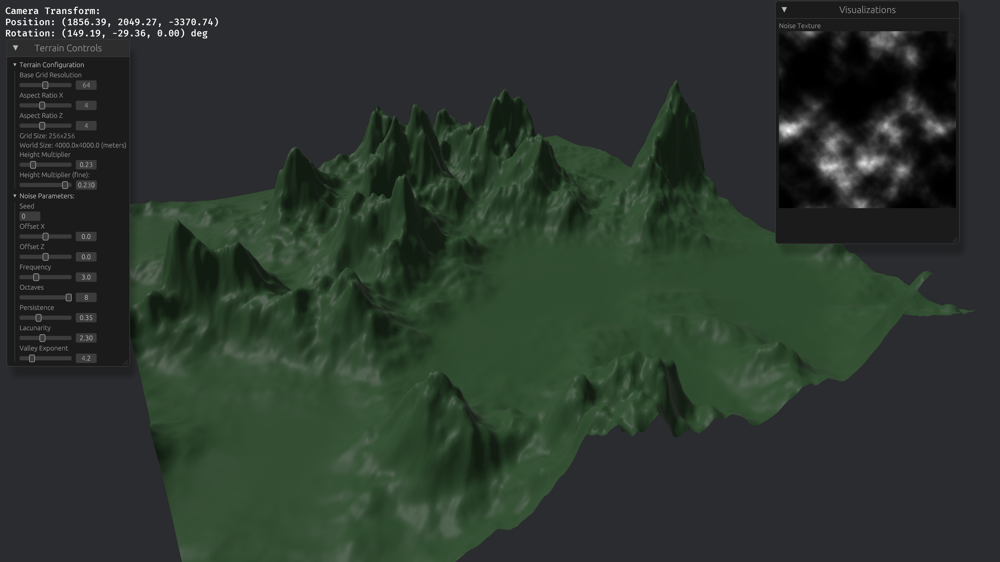

Procedural terrain generation is really cool. We all know how minecraft has a practically infinite world you can explore to your heart's content. I wanted to figure out how I could make some simple terrain myself, so here's how I did it.

Also: Yes! I'm using Rust now. It took me awhile to get comfortable with it, but I'm having a lot of fun with Rust! I've been using it since at least 2022 by now.

# Googling

The first thing you find when doing terrain generation is noise. The most common types of noise algorithms you'll find are Perlin noise.

After some quick googling I then found out that there are other variations on Perlin noise that result in less undesirable artifacts. One of them is called simplex noise. Unfortunately, simplex noise is a patented algorithm, however there is an algorithm similar to it called opensimplex noise.

The blog post _**Making maps with noise functions**_ from [Red Blob Games](https://www.redblobgames.com/maps/terrain-from-noise/) helped me the most on this project. It has lots of explanations paired with interactive visualizations on how you can use and modify noise to create different types of terrain features. This post single-handedly demystified the entire thing.

That blog post is so good in fact, that I won't spend any time explaining what I learned to you. Just go and read that post.

# The Bevy project

As of the time of writing, you can use my project [`bevy_procedural_terrain_gen`](https://github.com/wildwestrom/bevy_procedural_terrain_gen) (it's a long name to avoid collisions) within your own Bevy project, and run the demo.

It's not very well fleshed-out as its own plugin or library, so I recommend just taking the code and integrating it directly with your own project as a member of a [Cargo workspace](https://doc.rust-lang.org/book/ch14-03-cargo-workspaces.html) (it's MIT licensed).

