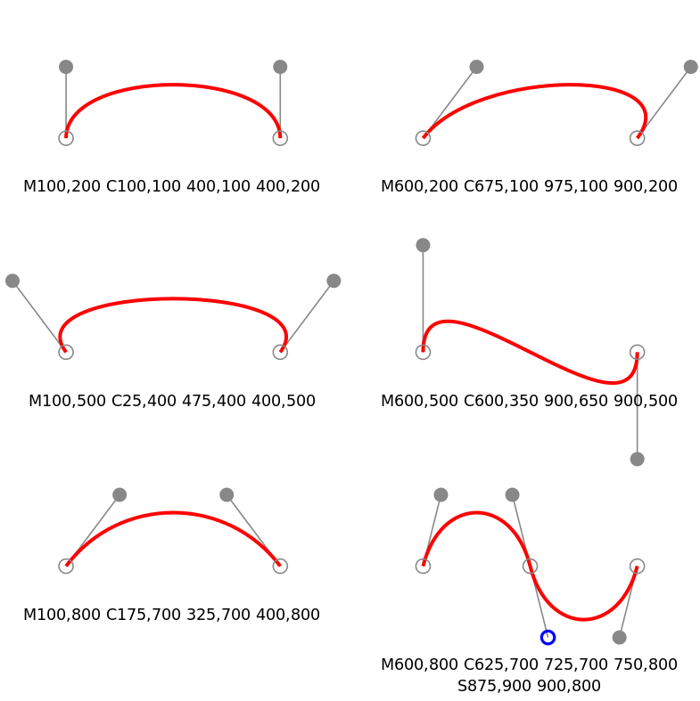
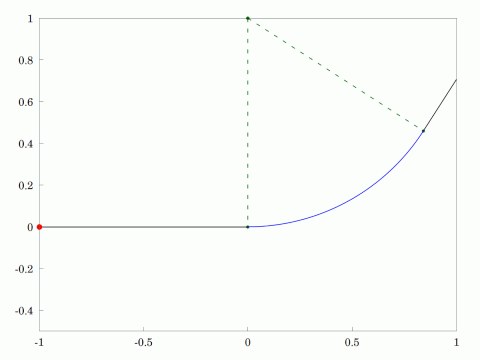
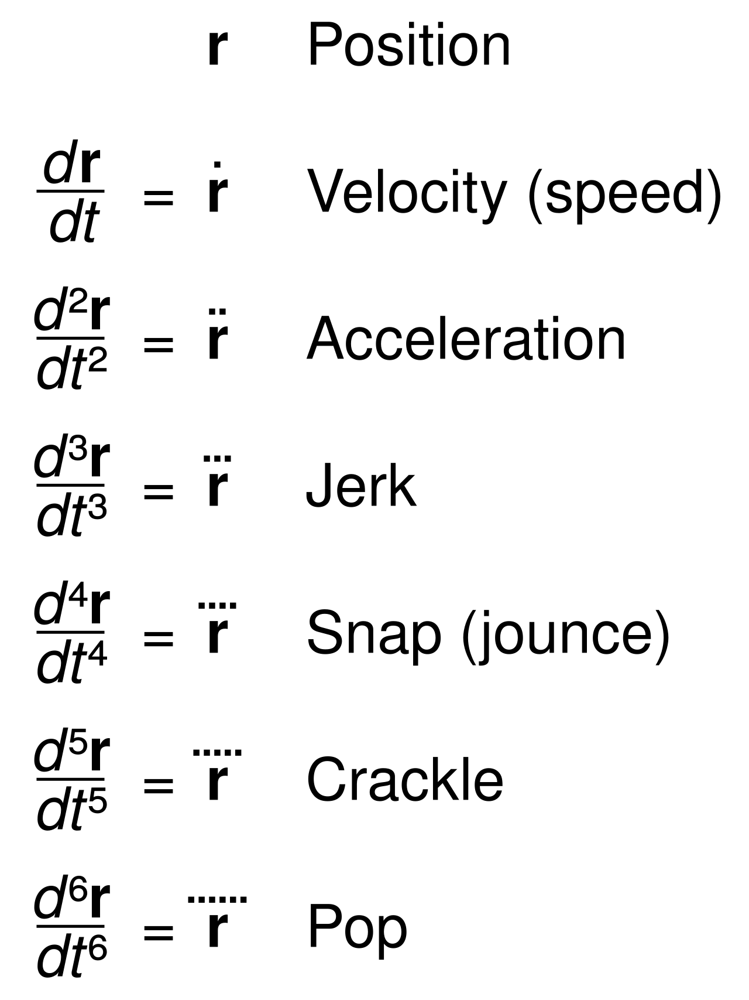
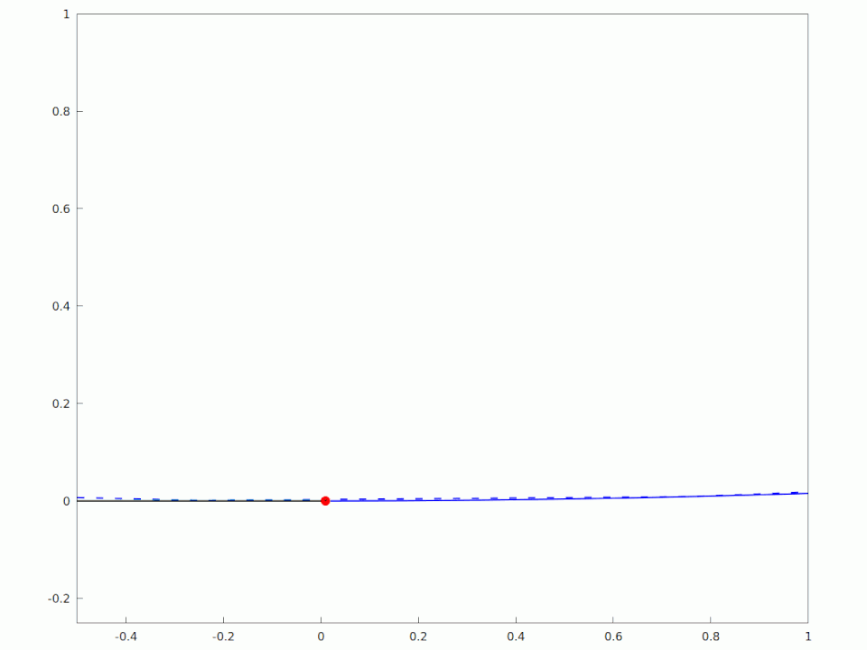

# How it started

One day during the summer of 2025 I was playing a game, [Transport Fever 2](https://www.transportfever2.com/). It's like model trains, but way more realistic. Alas, for me, it was not realistic enough. When I was placing tracks, I kept running into issues with the track building tools. Some were slighly annoying, how the tracks would bulge above roadways when I really wanted the road to adapt to the track. Some were immersion breaking, like how the tracks are always flat when they should tilt slightly on curves (this is called "_cant_" or "_superelevation_" for those who aren't railway engineers). Or another example, when I would join two curves together, the speed limits where they joined would change instantly instead of gradually like I wanted. Overall, I could never quite get my tracks to look right. The rest of this article will be detailing what I've discovered about why this is the case.

# The search for better curves begins

When I was first looking for information about this, I thought the problem was that the game's controls simply didn't give me precise enough controls to define the route I wanted. I thought what I needed was something like a Bézier curve editor, with handles to control how much the curve bends. I also had an intuition that these curves needed to be at the same angle where one curve joined the next.

## Introduction to Curves

A curve is a type of line that... curves. When you join many of these curves, especially ones with similar properties or with some rules on how they're combined, you get what is called a **spline**. Splines are fundamental to how we work with computer graphics and are very versatile. From motion graphics, to fonts, splines are everywhere. Usually you'll get either quadratic (2nd degree polynomial) or cubic (3rd degree polynomial) Bézier curve. How exactly Bézier curves work is out of scope for this article.

## Properties of Splines

The splines you might be familiar with when doing vector graphics can be manipulated in many ways. They can have sharp corners. They can loop over themselves. They can have straight lines or circular arcs mixed in. They can also form a continuously smooth connection. These continuously smooth connections were what I was after. I sort of know it when I see it and it's a simple idea on surface. How exactly to achieve this is quite a bit more complicated.

# First signs of progress

I used to never read academic papers, until I stumbled upon Raph Levien's PhD thesis [_From Spiral to Spline: Optimal Techniques in Interactive Curve Design_](https://levien.com/phd/thesis.pdf). This paper is what really helped me understand just what I was getting myself into. In this paper, Levien goes in-depth on the techniques people have used to create smooth curves and the different purposes for designing them.

## The Clothoid

When designing roads, the simplest shapes to use are lines and circles. All you need are a straight edge and a compass to draw them. However, you cannot transition directly between a straight line and a circular arc.

Why can't we just join them together? The answer lies in physics. When you are traveling along a straight line, ignoring things like wind and road conditions, there are no forces acting on your sides. When you're traveling along a circle or part of a circle (a circular arc) however, you feel a force pushing you toward the outside of the circle. This centrifugal force can be thought of as the effect of angular acceleration. So what happens when go directly from zero angular acceleration to non-zero angular acceleration? You get **jerk**.

One section of Levien's thesis is about the history of a curve known by a few different names: The Euler spiral, the clothoid, and the Cornu spiral. One of the practical uses of the clothoid happens to be for railway and road engineering. The clothoid is the answer to the question of how does one transition between a straight line and a circular arc.

### Jerk, Snap, Crackle, and Pop

Fundamentally, speed, acceleration, and our recently introduced "jerk" are all about your position in space and the rate of change of position.

When we talk about the rate of change of position, we call that speed or velocity. You moved over a distance between point A to point B, but how fast? That's your velocity. The rate your velocity changes is called acceleration. The rate your acceleration changes is called jerk. Physicists have quite whimsical names for some of these higher rates of change (or "derivatives" if you like calculus).

A [transition curve](https://en.wikipedia.org/wiki/Track_transition_curve) seeks to reduce physical forces by reducing the amount of angular velocity, angular jerk, and higher derivatives. The clothoid does this by transitioning between angular accelerations linearly.

## Other transition curves

Turns out you can keep taking derivatives of position to infinity. In engineering, usually we only worry about jerk at most, and so the clothoid has proven itself sufficient for over 100 years. There are more sophisticated transition curves, many of which are discussed in this paper: [Railway Transition Curves: A Review of the State-of-the-Art and Future Research](https://doi.org/10.3390/infrastructures5050043) In that high level overview, there are many transition curves designed to improve upon the shortcomings of the clothoid. The difficulty in engineering is that these curves must be practical to calculate and measure in the field.

Rather than consider the practical constraints of engineering, I became curious as to what a mathematically perfect transition curve would look like. When I say "mathematically perfect", I don't just mean curves that look good. According to Levien, the current term for this aesthetically pleasing smoothness is called **fairness**. This is not what I was after however.

# The ultimate transition curve

Before, we discussed transition curves through the lens of the continuity of derivatives of position. In mathematics there is a concept that describes exactly this called [**smoothness**](https://en.wikipedia.org/wiki/Smoothness). Smoothness describes to whether the curve is continuous, whether its derivatives are continuous, and how many derivatives the curve is continuous. We may say curves can be a class of continuous. I wanted a curve that was continuous on all higher derivatives up to infinity: a $$C^\infty$$ continuous curve. In a way, this is a Platonic ideal of a transition curve, one that smooths out every possible force one could experience traveling along the path.

That's not all though, we still need to join these curves together in a spline. Turns out, the degree of continuity at the joints of segments is called **geometric continuity** or class $$G$$. The answer was clear: I needed a class $$G^\infty$$ function. To put this into perspective, a straight line connected to a circular arc at the tangents only has class $$G^1$$ continuity. A clothoid transition bumps the geometric continuity up to $$G^2$$. When designing cars using CAD, in order to make sure the surface finish reflects light nicely, they will often make sure the surfaces are at least $$G^3$$ continuous. Any higher than that is usually overkill.

## Side tangent

As a result of my deep-dive into curves. I discovered Raph Levien's implementation of a $$G^4$$ continuous spline called `libspiro`. Also, I built my own track geometry engine using the Bevy game engine. It's quite buggy but if you want you can get it from GitHub, clone it, and run it. One of my goals was to create an algorithm that would find the optimal path using real track geometry constraints, but I haven't gotten that far.

<https://github.com/wildwestrom/track-geometry-experiments>

In the next part, we'll go deeper into my research into looking for the perfect transition curve.
